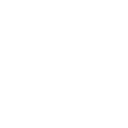
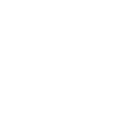

 

⌍ABOUT⌎

I am Matvei. I specialize in cybersecurity operations, combining offensive and defensive methodologies to expose weaknesses and engineer resilience. My work focuses on real-world application: if it doesn’t work under pressure, it’s irrelevant.

Currently studying in Moscow polytechnic university for Cybersecurity and in RSSU college for Tourism. Participating in various events hosted by top universities of Moscow.

 

⌍AREAS OF EXPERTISE⌎

<blockquote>
<strong>➠ Vulnerability Analysis & Exploitation  </strong>
<strong>⊹ 	Pinpointing security flaws with precision, whether in software, networks, or human systems.</strong>
</blockquote>

<blockquote>
<strong>➠ Incident Response & Threat Hunting  </strong>
<strong>⊹ 	Neutralizing active threats and building frameworks to detect and stop them faster.</strong>
</blockquote>

<blockquote>
<strong>➠ System Hardening & Defense  </strong>
<strong>⊹  Architecting defenses to withstand modern adversarial techniques.</strong>
</blockquote>

<blockquote>
<strong>➠ Code Development  </strong>
<strong>⊹ Writing purpose-driven tools in Python, C++, JavaScript, and Bash to solve problems and break limits.</strong>
</blockquote>

 

⌍ADDITIONAL INTERESTS⌎

<blockquote>
<strong>➠ Music  </strong>
<strong>⊹ Finished a 7 year music school program and performed playing the organ and piano at concerts and competitions."</strong>
</blockquote>
<blockquote>
<strong>➠ Art and design  </strong>
<strong>⊹ Being involved in art and design professionally is my family's tradition."</strong>
</blockquote>
<blockquote>
<strong>➠ Tourism  </strong>
<strong>⊹ Visited many European countries, which inspired me to get a college degree in tourism."</strong>
</blockquote>
<blockquote>
<strong>➠ English and languages  </strong>
<strong>⊹ Speak English fluently (C1 level) and currently studying Mandarin Chinese."</strong>
</blockquote>
<blockquote>
<strong>➠ Marketing and economy  </strong>
<strong>⊹ Read many Russian and foreign books, completed courses and visited conferences on the copic of economy."</strong>
</blockquote>

 

⌍HARD SKILLS⌎

  
  
  
  
  
  
  
  
  
  
  
  
  
  
  
  
  
  
  
  
  
  
  
  
  

 

⌍CONNECT⌎

<blockquote>
<strong>⊹ 	email: igumnov.hack@gmail.com  </strong>
<strong>⊹ 	tg: @ha1low  </strong>
<strong>⊹ 	ig: @ha1low  </strong>
</blockquote>
