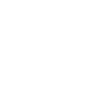

 

⌍ABOUT⌎

I am Matvei. I specialize in cybersecurity operations, combining offensive and defensive methodologies to expose weaknesses and engineer resilience. Social engineering, prevention of attacks, protection of computer systems and information infrastructure is what I'm best at.  My work focuses on real-world application: if it doesn’t work under pressure, it’s irrelevant.     Currently studying in Moscow polytechnic university for Cybersecurity and in RSSU college for Tourism. Participating in various events hosted by top universities of Moscow.

 

<blockquote>
<strong>Меня зовут Матвей. Я специализируюсь на операциях по кибербезопасности, сочетая наступательные и оборонительные методы для выявления слабых мест и повышения устойчивости. Социальная инженерия, предотвращение атак, защита компьютерных систем и информационной инфраструктуры - это то, в чем я разбираюсь лучше всего. Моя работа сосредоточена на применении в реальных условиях: если это не работает под давлением, это неактуально.
  
В настоящее время учусь в Московском политехническом университете по специальности "Информационная безопасность" и в колледже РГСУ по специальнольности "Туризм". Участвую в различных мероприятиях, проводимых ведущими университетами Москвы.</strong>
</blockquote>

 

⌍AREAS OF EXPERTISE⌎

➠ Vulnerability Analysis & Exploitation  
⊹ 	Pinpointing security flaws with precision, whether in software, networks, or human systems.
<blockquote>
<strong>➠ Анализ уязвимостей и их использование  </strong>
<strong>⊹ 	Точное выявление недостатков в системе безопасности, будь то в программном обеспечении, сетях или человеческих системах.</strong>
</blockquote>

➠ Incident Response & Threat Hunting  
⊹ 	Neutralizing active threats and building frameworks to detect and stop them faster.
<blockquote>
<strong>➠ Реагирование на инциденты и поиск угроз  </strong>
<strong>⊹ 	Нейтрализация активных угроз и создание систем для их более быстрого обнаружения и пресечения.</strong>
</blockquote>

➠ System Hardening & Defense  
⊹  Architecting defenses to withstand modern adversarial techniques.
<blockquote>
<strong>➠ Укрепление и защита системы  </strong>
<strong>⊹  Создание системы защиты, позволяющей противостоять современным противоборствующим методам.</strong>
</blockquote>

➠ Code Development  
⊹ Writing purpose-driven tools in Python, C++, JavaScript, and Bash to solve problems and break limits.
<blockquote>
<strong>➠ Разработка кода  </strong>
<strong>⊹ Написание специализированных инструментов на Python, C++, JavaScript и Bash для решения проблем и преодоления ограничений.</strong>
</blockquote>

 

⌍ADDITIONAL INTERESTS⌎

➠ Music  
⊹ Finished a 5 year music school program and performed playing the organ and piano at concerts and competitions.
<blockquote>
<strong>➠ Музыка  </strong>
<strong>⊹ Окончил 5-летнюю музыкальную школу и выступал с концертами и конкурсами по игре на органе и фортепиано.</strong>
</blockquote>

➠ Art and design  
⊹ Being involved in art and design professionally is my family's tradition.
<blockquote>
<strong>➠ Искусство и дизайн  </strong>
<strong>⊹ Профессиональное занятие искусством и дизайном - это традиция моей семьи.</strong>
</blockquote>

➠ Tourism  
⊹ Visited many European countries, which inspired me to get a college degree in tourism.
<blockquote>
<strong>➠ Туризм  </strong>
<strong>⊹ Побывал во многих европейских странах, что вдохновило меня на получение образования в области туризма.</strong>
</blockquote>

➠ English and languages  
⊹ Speak English fluently (C1 level) and currently studying Mandarin Chinese.
<blockquote>
<strong>➠ Английский и другие языки  </strong>
<strong>⊹ Свободно говорю по-английски (уровень С1) и в настоящее время изучаю китайский.</strong>
</blockquote>

➠ Marketing and economy  
⊹ Read many Russian and foreign books, completed courses and visited conferences on the copic of economy.
<blockquote>
<strong>➠ Маркетинг и экономика  </strong>
<strong>⊹ Прочитал много российских и зарубежных книг, проходил курсы и посещал конференции на тему экономики.</strong>
</blockquote>

 

⌍HARD SKILLS⌎

  
  
  
  
  
  
  
  
  
  
  
  
  
  
  
  
  
  
  
  
  
  
  
  
  

 

⌍CONNECT⌎

<blockquote>
<strong>⊹ 	email: igumnov.hack@gmail.com  </strong>
<strong>⊹ 	tg: @ha1low  </strong>
<strong>⊹ 	ig: @igumn0v  </strong>
</blockquote>
